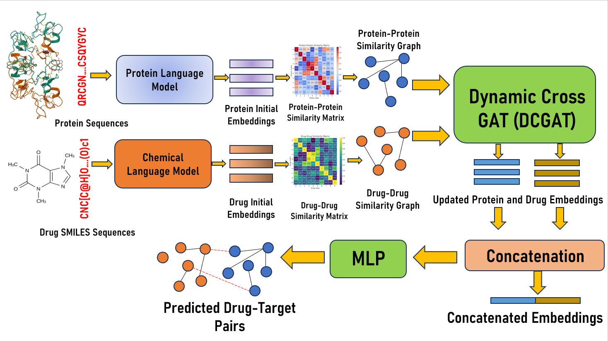
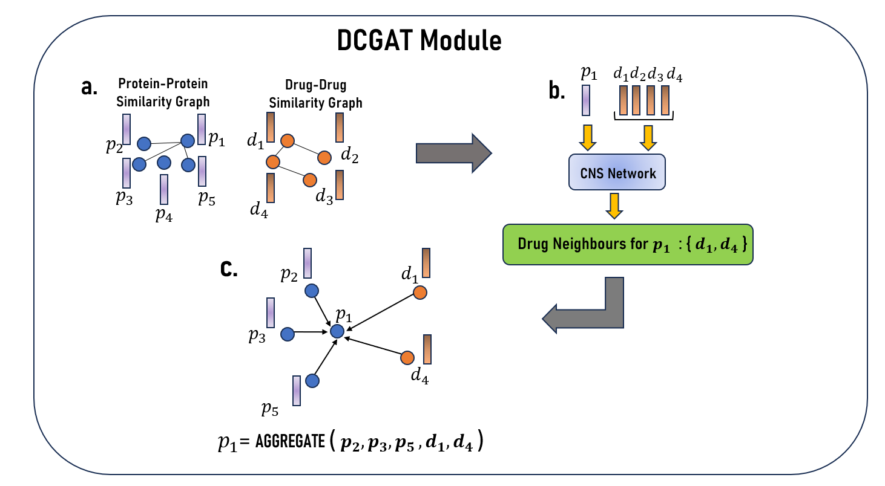

# DCGAT-DTI: Dynamic Cross-Graph Attention for Drug–Target Interaction Prediction

**DCGAT-DTI** is a novel deep learning framework for **Drug–Target Interaction (DTI) prediction**, designed to enhance drug discovery by dynamically modeling interactions between chemical compounds and proteins. Unlike traditional methods that process drug and protein similarity graphs independently, **DCGAT-DTI** leverages a **Dynamic Cross-Graph Attention (DCGAT)** module to capture intra- and cross-graph dependencies.

## Key Features and Novelty
- **DCGAT Module**: Enables **cross-modal message passing** between drugs and proteins, allowing embeddings to dynamically **incorporate information across both modalities** through intra- and cross-graph attention mechanisms.
- **CNS Network (Cross Neighborhood Selection)**: A **GCN-based selection mechanism** that uses **Gumbel-Softmax Estimator** to  **dynamically selects cross-modal neighbors**, ensuring that each drug and protein node interacts with the most relevant counterparts.

## Running Different Configurations
You can run  in **six different ways** based on dataset balancing and splitting strategy:

### **Balanced Dataset**
```bash
# Warm Start
python run.py --config-name drugbank_train_GAT.yaml \"tuning.param_search.tune=False\" \"datamodule.splitting.balanced=True\" \"datamodule.splitting.splitting_strategy=random\"

# Cold Start for Drug
python run.py --config-name drugbank_train_GAT.yaml \"tuning.param_search.tune=False\" \"datamodule.splitting.balanced=True\" \"datamodule.splitting.splitting_strategy=cold_drug\"

# Cold Start for Protein
python run.py --config-name drugbank_train_GAT.yaml \"tuning.param_search.tune=False\" \"datamodule.splitting.balanced=True\" \"datamodule.splitting.splitting_strategy=cold_target\"
```

### **Unbalanced Dataset**
```bash
# Warm Start
python run.py --config-name drugbank_train_GAT.yaml \"tuning.param_search.tune=False\" \"datamodule.splitting.balanced=False\" \"datamodule.splitting.splitting_strategy=random\"

# Cold Start for Drug
python run.py --config-name drugbank_train_GAT.yaml \"tuning.param_search.tune=False\" \"datamodule.splitting.balanced=False\" \"datamodule.splitting.splitting_strategy=cold_drug\"

# Cold Start for Protein
python run.py --config-name drugbank_train_GAT.yaml \"tuning.param_search.tune=False\" \"datamodule.splitting.balanced=False\" \"datamodule.splitting.splitting_strategy=cold_target\"
```
---

## Different Dataset Usage
Follow these steps to integrate your own custom dataset:

1. **Modify the Preprocessing Pipeline**  
   - Update `utils.PREPROCESS` to add your dataset name.

2. **Add a Preprocessing Script**  
   - The script should return the following data structures:

   ```python
   X_drug: nx1 pd.DataFrame  # Drug data
   # Index: Drug names
   # Column 1: SMILES sequence

   X_target: mx1 pd.DataFrame  # Protein data
   # Index: Target names
   # Column 1: Protein sequence

   DTI: mxn (available) pd.DataFrame  # Drug-Target Interaction
   # Index: 0-mxn
   # Column 1: Drug names matching X_drug index
   # Column 2: Target names matching X_target index
   # Column 3: Interaction label (0,1)
   ```

3. **Update Configuration**  
   - Add a new `train.yaml` (e.g., `bindingDB_train_GAT.yaml`) in the `configs/` directory to define preprocessing and datamodule settings.

---

## Integration of a Custom Featurizer
If you want to modify the drug or protein featurization, follow these steps:

1. **Add New Featurizers**  
   - Implement new featurization methods in `module.featurizer.drug_featurizer` and `module.featurizer.prot_featurizer`.  
   - Ensure the featurizers return:

     ```python
     nxq  # Drug embeddings (q = embedding size)
     mxp  # Protein embeddings (p = embedding size)
     ```

2. **Modify Configuration Files**  
   - Update `configs.featurizer` to reflect the new featurizers.
   - Set `drug_dim` and `prot_dim` in `configs.module.GAT`.

---

## Using a Custom Classifier
To integrate a new classification model:

1. **Create a New Model Pipeline**  
   - Add a new model file in the `module` directory (similar to `GAT.py` or `MLP.py`).

2. **Update Configuration Files**  
   - Add necessary settings in `configs.module`, following the structure of `config.module.GAT` for `GAT.py`.

---

### 📌 Notes
- Ensure that all custom implementations are compatible with the existing pipeline.
- Modify necessary configurations to properly register new data, featurizers, or classifiers.

## Complete Pipeline


## DCGAT Module



